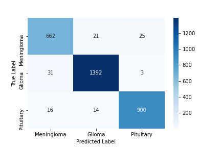
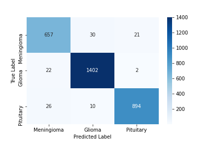

# General overview
Used attention from the paper [[1]](#1) and multiheadattention from paper [[2]](#2) and compared the results. Tried using dropout and hyperparameter optimization 

## Average Time taken

loss  | time(seconds)
--- | --- 
gated attention | 20171
multihead attention | 25448

## Results

loss  | aucuracy
--- | --- 
gated attention | 96.43 
multihead attention | 96.41

### Confusion Matrix
#### Gated attention

#### Multihead attention

## References
- [1]</a> Schlemper, Jo & Oktay, Ozan & Chen, Liang & Matthew, Jacqueline & Knight, Caroline & Kainz, Bernhard & Glocker, Ben & Rueckert, Daniel. (2018). Attention-Gated Networks for Improving Ultrasound Scan Plane Detection. /par
- <a id="2">[2]</a> Vaswani, Ashish & Shazeer, Noam & Parmar, Niki & Uszkoreit, Jakob & Jones, Llion & Gomez, Aidan & Kaiser, Lukasz & Polosukhin, Illia. (2017). Attention Is All You Need. 
