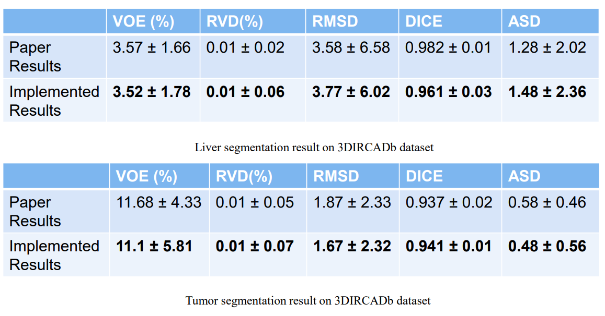

# Implementation of paper H-DenseUNet: Hybrid Densely Connected UNet for Liver and Tumor Segmentation from CT Volumes

## Output Examples

## Test Results on 3DIRCADb 

## References
- https://github.com/xmengli999/H-DenseUNet
