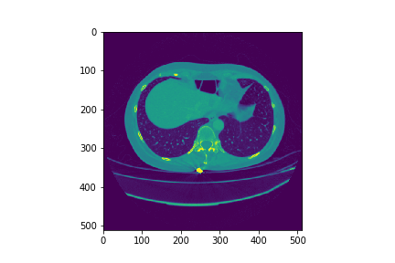

# Implementation of paper H-DenseUNet: Hybrid Densely Connected UNet for Liver and Tumor Segmentation from CT Volumes

## Output Examples

## Test Results on 3DIRCADb 

Dice Score  | Liver | Tumor
--- | --- | ---
1 | 0.9419 | 0.51.01
